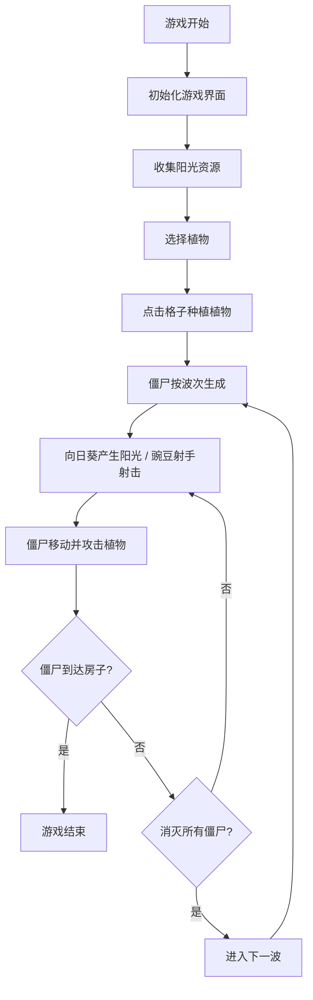

## 1. 产品概述

《植物大战僵尸》网页游戏精简版，基于Vue 3构建，让玩家体验经典塔防游戏的核心乐趣。
- 使用emoji和CSS实现简约而贴近原作的视觉风格，无需图片资源
- 纯前端实现，轻量快速，在浏览器即可畅玩

## 2. 核心功能

### 2.1 功能模块

1. **游戏主界面**：6x4网格草坪，阳光收集，植物选择栏
2. **种植系统**：点击种植向日葵（产生阳光）和豌豆射手（攻击僵尸）
3. **僵尸系统**：从右侧按波次生成，向左移动并啃食植物
4. **战斗系统**：豌豆射击、僵尸啃食、碰撞检测
5. **游戏状态**：阳光收集、游戏开始/暂停/结束

### 2.2 页面详情

| 页面名称 | 模块名称 | 功能描述 |
|-----------|-------------|---------------------|
| 游戏主页面 | 游戏区域 | 6x4网格草坪，植物与僵尸的战斗舞台 |
| 游戏主页面 | 资源栏 | 显示当前阳光数量，阳光自动掉落收集 |
| 游戏主页面 | 植物选择栏 | 显示可种植的植物及其阳光消耗 |
| 游戏主页面 | 状态显示 | 游戏波次、开始/暂停按钮、游戏结束提示 |

## 3. 核心流程

## 4. 用户界面设计

### 4.1 设计风格
- **主色调**：草坪绿色 (#7cb342)，泥土棕色 (#8d6e63)，天空蓝色 (#87ceeb)
- **强调色**：向日葵黄色 (#ffd600)，豌豆绿色 (#4caf50)，僵尸灰色 (#9e9e9e)
- **视觉元素**：使用emoji表示植物和僵尸，CSS网格布局实现游戏区域
- **字体**：使用圆润可爱的字体，配合游戏主题
- **动画**：豌豆飞行动画、僵尸移动动画、植物种植效果、阳光收集动画

### 4.2 页面设计概述

| 页面名称 | 模块名称 | UI元素 |
|-----------|-------------|-------------|
| 游戏主页面 | 游戏区域 | CSS网格布局，6列4行，草地背景，格子悬停效果 |
| 游戏主页面 | 植物选择栏 | 横向卡片布局，显示植物emoji、名称、消耗阳光，点击选中 |
| 游戏主页面 | 资源栏 | 左侧阳光计数器 + 阳光图标，右侧控制按钮 |
| 游戏主页面 | 状态提示 | 居中弹窗显示游戏结束/胜利信息，带重新开始按钮 |

### 4.3 响应式
- 桌面端优先，游戏区域居中显示
- 移动端适配：缩小格子尺寸，调整布局为垂直排列
- 触摸设备优化：增大点击区域，支持触摸种植
