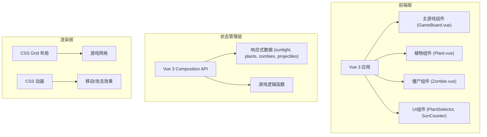

## 1. 架构设计



## 2. 技术描述

- **前端框架**: Vue 3 + Vite
- **语言**: JavaScript (ES6+)
- **状态管理**: Vue 3 Composition API (ref, reactive, computed)
- **构建工具**: Vite
- **样式方案**: 原生CSS + CSS Grid布局 + CSS Animations
- **无第三方依赖**: 纯原生实现，不使用游戏引擎

## 3. 项目结构

```
src/
├── components/
│   ├── GameBoard.vue      # 游戏主面板
│   ├── Plant.vue          # 植物组件
│   ├── Zombie.vue         # 僵尸组件
│   ├── PlantSelector.vue  # 植物选择器
│   └── SunCounter.vue     # 阳光计数器
├── composables/
│   └── useGame.js         # 游戏核心逻辑
├── utils/
│   └── gameConfig.js      # 游戏配置常量
├── App.vue                # 根组件
├── main.js                # 入口文件
└── style.css              # 全局样式
```

## 4. 数据模型定义

### 4.1 游戏状态数据

```javascript
// 游戏配置
const GAME_CONFIG = {
  GRID_COLS: 6,      // 网格列数
  GRID_ROWS: 4,      // 网格行数
  CELL_WIDTH: 80,    // 格子宽度
  CELL_HEIGHT: 80,   // 格子高度
  INITIAL_SUN: 100,  // 初始阳光
  SUN_INTERVAL: 5000, // 阳光生成间隔
}

// 植物类型
const PLANT_TYPES = {
  sunflower: {
    name: '向日葵',
    cost: 50,
    health: 100,
    sunProduction: 25,
    sunInterval: 8000,
    emoji: '🌻'
  },
  peashooter: {
    name: '豌豆射手',
    cost: 100,
    health: 100,
    damage: 20,
    attackInterval: 1500,
    emoji: '🌱'
  }
}

// 僵尸类型
const ZOMBIE_TYPES = {
  normal: {
    name: '普通僵尸',
    health: 100,
    damage: 10,
    speed: 0.5,
    attackInterval: 1000,
    emoji: '🧟'
  }
}
```

### 4.2 响应式数据结构

```javascript
// 游戏状态
const gameState = reactive({
  isPlaying: false,      // 游戏是否进行中
  isPaused: false,       // 是否暂停
  isGameOver: false,     // 游戏是否结束
  isVictory: false,      // 是否胜利
  wave: 1,               // 当前波次
  sunlight: 100,         // 当前阳光数
  selectedPlant: null,   // 当前选中的植物
  plants: [],            // 植物列表 [{ id, type, row, col, health, lastSunTime, lastAttackTime }]
  zombies: [],           // 僵尸列表 [{ id, type, row, x, health, isAttacking }]
  projectiles: [],       // 子弹列表 [{ id, row, x, damage }]
  suns: []               // 掉落的阳光 [{ id, x, y, value }]
})
```

## 5. 核心函数

| 函数名 | 功能描述 |
|--------|----------|
| `startGame()` | 初始化并开始游戏 |
| `pauseGame()` | 暂停/继续游戏 |
| `restartGame()` | 重新开始游戏 |
| `selectPlant(type)` | 选择要种植的植物 |
| `plantAt(row, col)` | 在指定位置种植植物 |
| `spawnZombie()` | 生成僵尸 |
| `collectSun(sunId)` | 收集阳光 |
| `gameLoop()` | 游戏主循环 |
| `checkCollisions()` | 碰撞检测 |
| `updateZombies()` | 更新僵尸位置和状态 |
| `updateProjectiles()` | 更新子弹位置 |
| `checkGameOver()` | 检查游戏是否结束 |
